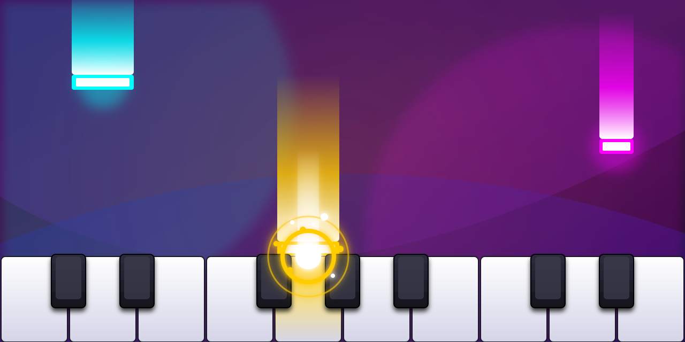

# Rhythm Piano

## Run
[Open on GitHub Pages](https://iliagrigorevdev.github.io/rhythmpiano-web/)

## About
Rhythm Piano is an interactive musical rhythm game where you play the piano by hitting falling notes at the right time.
Import and perform any MIDI file, or load tracks shared by friends to build your own personal song collection.
The game dynamically controls the camera and plays full accompaniment backing tracks, letting you focus entirely on performing the melody.
Earn stars based on your accuracy and aim for a high score!
The folder icon allows you to quickly import, play, and share files.

## Songs
Check out this [list of songs](https://gist.github.com/iliagrigorevdev/d9f25d63100f88d978960e228d128cd0) that you can load and play in the game!

## Controls
Tap the piano keys at the bottom of the screen as the falling notes reach the red hit line.

## Attributions
[Salamander Grand Piano V3](https://archive.org/details/SalamanderGrandPianoV3) by Alexander Holm, licensed under Creative Commons Attribution 3.0.
